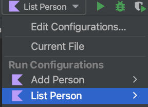

# Protobuf with kotlin

This repo is an example of using protobuf with kotlin.

## Motive

The code on https://protobuf.dev/getting-started/kotlintutorial/
(SHA [05baf19](https://github.com/protocolbuffers/protocolbuffers.github.io/commit/05baf19fa7c167795f69ecf45ce3ef883446dce5))
simply doesn't compile and the required dependencies were not documented.

This repo provides a working example of using protobuf with kotlin. It fixes the errors and issues present
[here](https://protobuf.dev/getting-started/kotlintutorial/).

## How to run

You may need java 1.8 or later; openjdk version "1.8.0_362" was used to compile this.

### Using IntelliJ IDEA

Simply run `Add Person` and `List Person` configs in IntelliJ IDEA



### On the command line

```bash
./gradlew run --args='add_person address_book.txt' --console=plain
```

```bash
./gradlew run --args='list_person address_book.txt'
```
